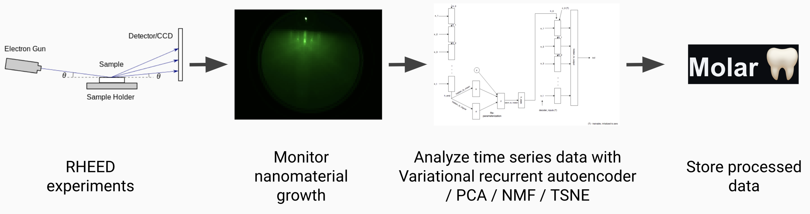

# rheed-viz

Database, dimensionality reduction, and visualization dashboard for RHEED data

### How it works

### Environment Setup
To setup the environment, run `conda env update --file env.cpu.yml`, which will create a conda environment called rheed-viz

Next setup the default local database, responding to the commands as follows (blank means hit enter):

`molarcli install local`

Where do you want to install Molar 🦷 (./molar_data_dir):   
Password for Postgres admin: **rheed**  
Server url (http://localhost):  
Allow the backend to send email? [y/n]: **n**  
Backend port (8000):  
Number of workers for the backend (2):  
Full name: **default**  
Email: **default@rheed.com**  
Password: **rheed**   
Do you want to start it now? [y/n]: **y**

If you get a permissions error on linux, you can change the user group of docker using the following command:
`sudo usermod -G docker your_username; su - your_username`

### Start the RHEED database
`python database-setup/dbsetup.py`

### Launching app
Streamlit frontend uses `requirements.txt`
Run locally with `streamlit run app.py`

### RHEED jpg data
* Pre-processed, dimensionality reduced images are in `./data/` saved as `npz` files. They can be loaded as shown in `Rheed-viz.ipynb`
* Process AVI movies by installing ffmpeg and doing `ffmpeg -i MovieName.avi -vf  fps=<num_fps>  c01_%04d.jpg -hide_banner`
* Raw jpgs: https://figshare.com/s/73b8ab6cb131acbbe9d4
